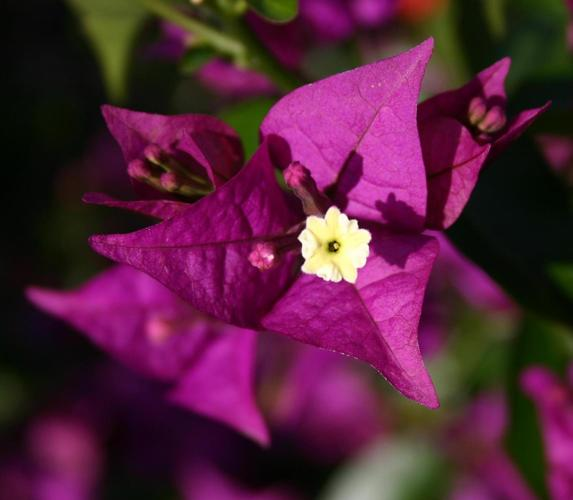

# Create Your Own Image Classifier
'
## _Showcase of the core workload of a supervised learning task in Computer Vision_

This **supervised learning task** involves training an artificial intelligence (AI) model to learn a mapping between input data and corresponding output labels. This flower classifier revolves around teaching the AI model to correctly identify **102 different types of flowers** based on their features or characteristics.

## Structure and features of this showcase

- **Data Preprocessing**  This can include resizing images to a uniform size, normalizing pixel values, and augmenting the data with techniques like rotation, flipping, or brightness adjustments to make the model more robust.
- **Feature Extraction:** Feature extraction involves converting the images into numerical representations that the AI model can understand. For computationaly efficiency transfer learning was used for knowledge transfer and less computing. 
- **Model Training:** The model is trained using the training and validation dataset. During training, the model learns to map the input images to their corresponding flower species labels. This is done through a process of adjusting model parameters (weights and biases) using optimization algorithms such as gradient descent to minimize the prediction error. 
- **Hyperparameter Tuning:** Various hyperparameters, like learning rate, batch size, and network architecture, aree tuned to optimize the model's performance.
- **Validation and Testing:** The model's performance is evaluated on the test set to assess its accuracy and generalization to new, unseen data. Accuracy as the key metric is used to quantify the model's performance.
- **Deployment:** Mode of deployment in this showcase is command line application, where it can classify flowers in new images. 

> The project outlines the key steps to implement this supervised learning task,
> parts like data gathering and labelling, additionally more tailored approaches like "fine-tuning" to the dataset, 
> as well as model deployment in the cloud have been ommitted, but are only limited steps away.
> This showcase demonstrates the ability to conduct a computer vision problem from idea to solution up on request. 

## Tech

This application uses a number of open source projects to work properly:

- [Python](https://docs.python.org/3/) Core programming language in AI and Data Science
- [Pytorch](https://pytorch.org) - Core artificial intelligence framework
- [Torchvision](https://pytorch.org/vision/stable/index.html) - Computer vision specific sub-library of pytorch
- [Matplotlib](https://matplotlib.org) - Comprehensive library for creating static, animated, and interactive visualizations in Pythoncd 
- [Numpy](https://numpy.org) - The fundamental package for scientific computing with Python
- [PIL](https://pillow.readthedocs.io/en/stable/) -The Python Imaging Library

